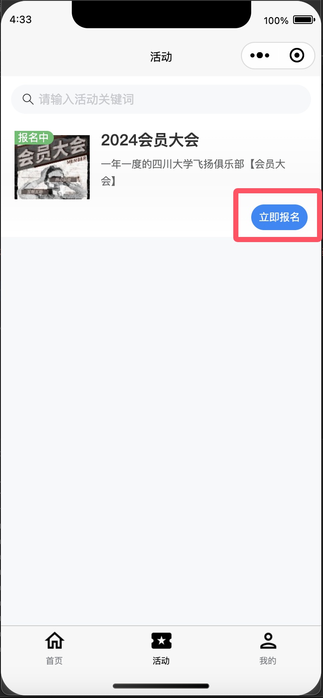
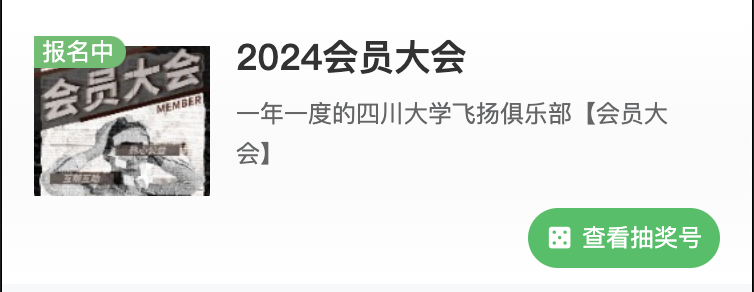
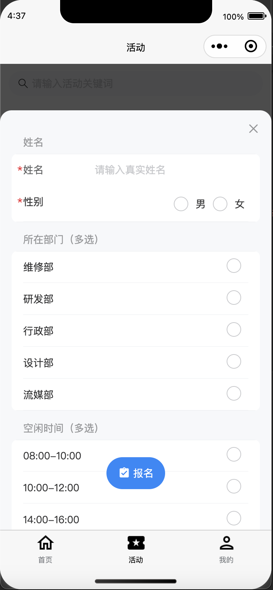

# 活动报名

活动系统承载了飞扬俱乐部每一个活动的展示与报名功能，您可以通过报名参加我们组织的多种多样的活动。

本节将引导您进行活动的报名。

首先，请点击底部导航栏至“活动”栏

列表中所有的状态为“<mark style="color:green;">报名中</mark>”且右下角“<mark style="color:blue;">立即报名</mark>”按钮可点击的活动，均可直接点击报名。

<figure><figcaption>
可报名的“会员大会”活动
</figcaption></figure>

对于抽奖类型的活动，在报名成功后，您可以获得一个抽奖号：

<figure><figcaption>
可以查看抽奖号
</figcaption></figure>

对于大修类型的活动，您需要填写更具体的报名信息：

<figure><figcaption>
大修专属报名表
</figcaption></figure>

显然，大修类型的活动仅对“小干事”和“技术员”开放报名。如果您是普通用户，就请不要报名大修啦～
