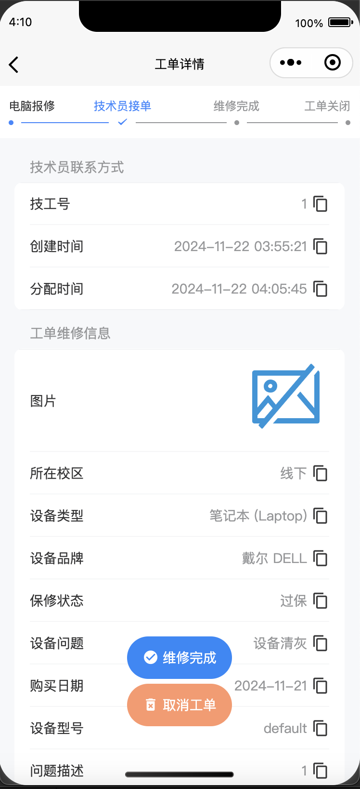

# 查看当前工单

在您的工单创建成功后，就可以在主页看到您的工单了。此时，点击该工单的任意区域，将进入工单详情页面。

一个标准的报修工单详情页面如下：

<figure><figcaption>
一个标准工单详情页
</figcaption></figure>

其包含的内容有：

1. 工单分配信息：包括技术员工号、分配时间等
2. 工单维修信息：您在创建时填写的故障信息

工单内容原则上不支持二次修改，如果您想改变工单的具体内容，请[重新发起新的报修工单](new.md)

在您认为工单不需要再维修时，可以点击“<mark style="color:orange;">取消工单</mark>”按钮取消该工单。强烈推荐您与技术员沟通后再取消工单

在您认为工单已经维修完成时，可以点击“<mark style="color:blue;">维修完成</mark>”按钮结束该工单。云上飞扬的工单均为双向结单制，即用户和技术员都确认工单已维修完成后才会正式结束该工单。
