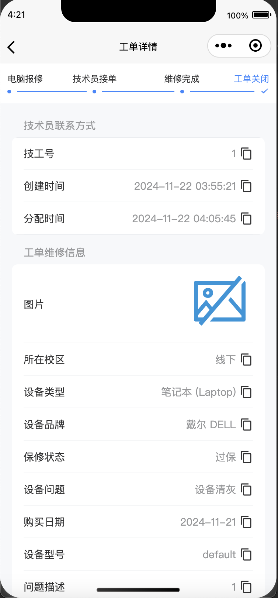

# 查看历史工单

为了方便用户回溯维修记录，也为了方便我们进行工单追踪，云上飞扬支持查询您所有的已结束工单。

您可以在“我的-历史工单”中找到所有的历史工单

<figure><figcaption>
进入历史工单
</figcaption></figure>

在该页面内，您同样可以通过点击某工单来获取工单详情。

<figure><figcaption>
已完成的工单详情
</figcaption></figure>
