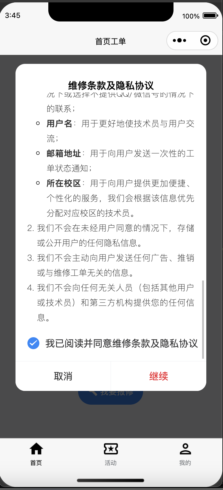
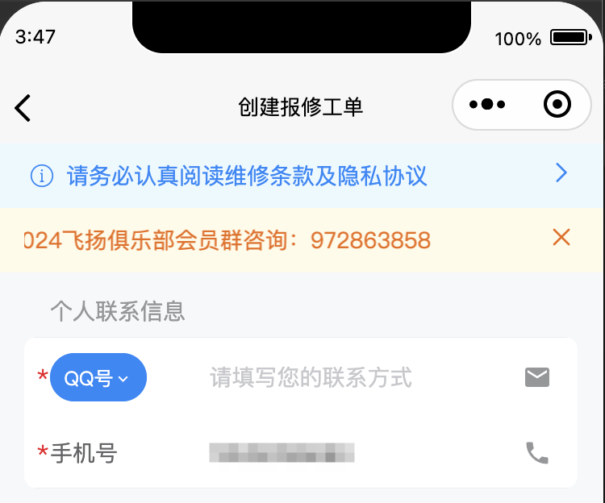
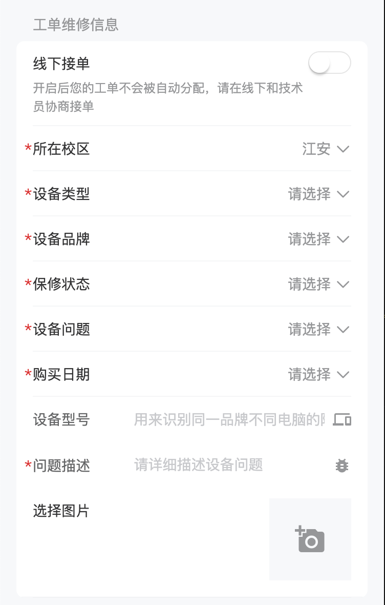
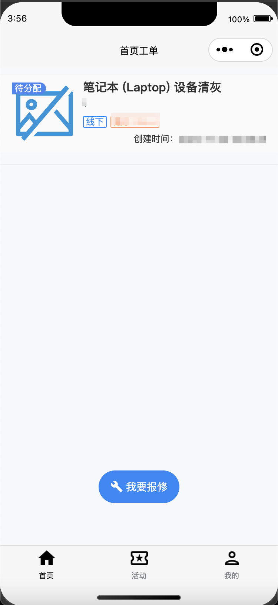

# 发起报修工单

您可以通过发起一个报修工单来享受我们的维修咨询服务，您需要填写一些关键信息，以便接单技术员可以更快速地定位您的实际问题。接下来，本节将引导您发起一个标准的报修工单。

请于主页点击“我要报修”的蓝色按钮，进入报修流程。

<figure><figcaption><p>请您仔细阅读并理解我们的维修政策</p></figcaption></figure>

<figure><figcaption><p>于顶部完善您的个人联系信息（至关重要）</p></figcaption></figure>

<figure><figcaption><p>接下来完善您的故障信息</p></figcaption></figure>

注：

1.  除手机号外，请至少添加一种额外的联系方式。支持的联系方式有：

    ```javascript
    "QQ号", "微信号", "WhatsApp", "Telegram", "Messenger"
    ```
2. “<mark style="color:orange;">线下接单</mark>”按钮开启时，该工单将<mark style="color:red;">**不会**</mark>被自动分配！此时默认您已经在线下找到了目标技术员，将由其手动接取您的工单。如果您没有指定的技术员，请<mark style="color:red;">不要</mark>选择此按钮哦～
3. 所有标记 <mark style="color:red;">\*</mark> 的项目均为必填项目，其中，“<mark style="color:green;">购买日期</mark>”是便于分辨您的设备报修的标志，如您已经准确填写“<mark style="color:yellow;">报修状态</mark>”，且记不清具体购买日期，则“<mark style="color:green;">购买日期</mark>”可以任填。


提交成功后，会自动返回首页，届时您将在首页最上端看到您刚刚创建的工单。

<figure><figcaption><p>提交成功后如图</p></figcaption></figure>

如果您看到上图的列表已出现刚刚提交的工单，则说明您的工单已经提交成功。工单状态改变时，左上角的tag也会相应变化，具体状态如下：

<table><thead><tr><th width="172">TAG</th><th>状态</th></tr></thead><tbody><tr><td><p></p><p></p><p></p></td><td>工单待分配</td></tr><tr><td><p></p><p></p><p></p></td><td>工单已被接单并维修中</td></tr><tr><td><p></p><p></p><p></p></td><td>工单已维修完成</td></tr><tr><td><p></p><p></p><p></p></td><td>工单在待分配状态时被用户手动取消</td></tr><tr><td><p></p><p></p><p></p></td><td>工单因故无法维修，被异常关闭</td></tr></tbody></table>

至此，一个完整的报修工单就创建完成了。后续有关操作或提示，请看下节。
