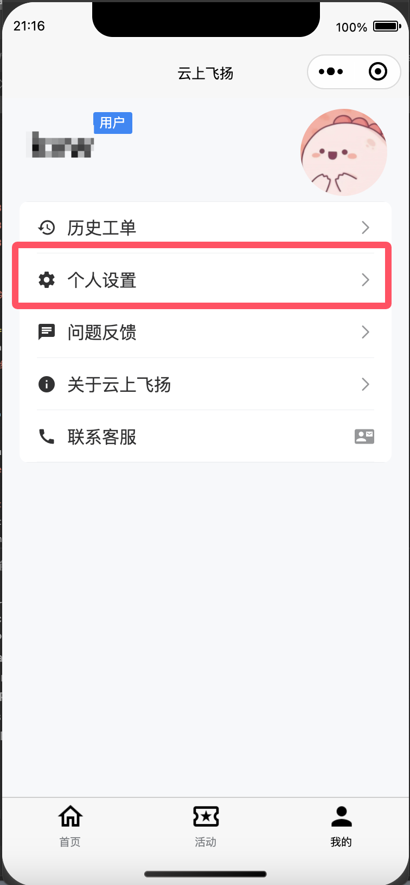
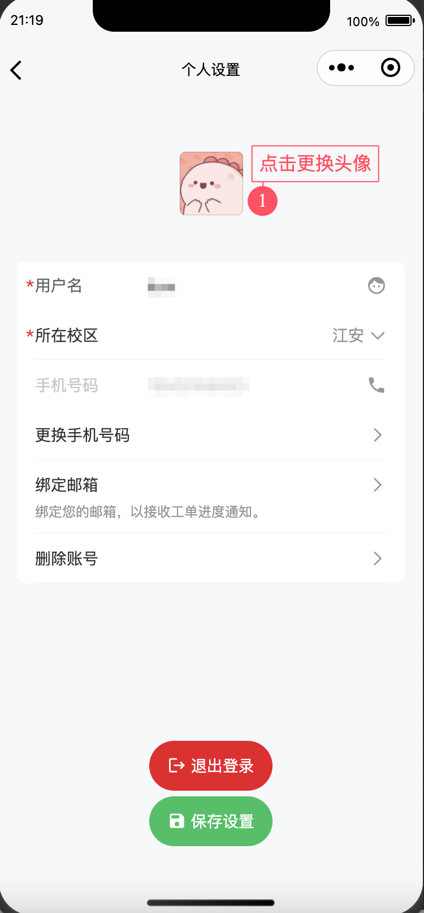

# 用户信息编辑

在使用本小程序的时候，您可能会被要求提供一些其他的信息，例如您的邮箱地址等通知信息。此时就需要使用我们的用户信息编辑功能，进行个人信息的增删或修改。

1. 在“我的”栏中，点击“个人设置”，进入编辑页

<figure><figcaption></figcaption></figure>

2. 在编辑页中即可修改个人信息

<figure><figcaption></figcaption></figure>

注：点击头像即可更换新头像，绑定邮箱时需要通过链接验证哦～
