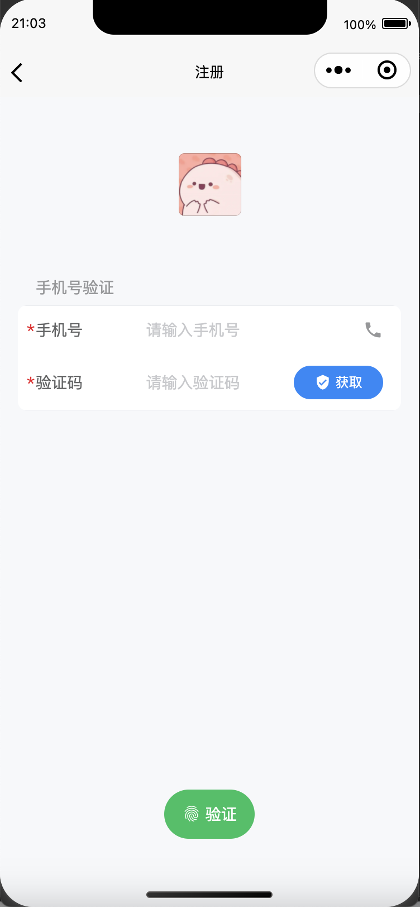
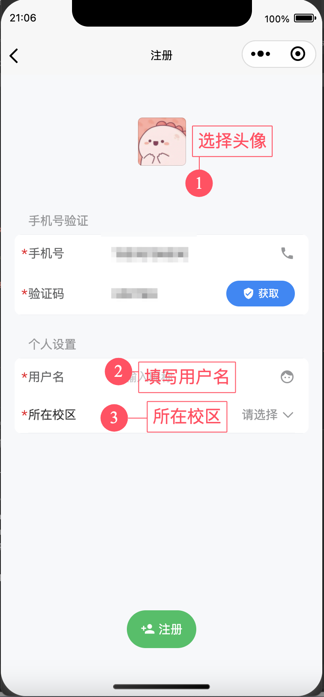

# 新用户注册

初次打开小程序，您可以正常浏览部分功能。但如果想使用活动报名、工单提交等功能，则需要完成账号注册流程。本节将引导您完成账号注册。


使用本小程序，需要您有一个可以正常使用的手机号码


接下来我们正式开始注册：

1. 点击右下角“我的”栏，点击登录按钮

<figure><figcaption></figcaption></figure>

2. 输入手机号及验证码，完成手机号绑定

<figure><figcaption></figcaption></figure>

3. 核验通过后，完善必须的基本信息

<figure><figcaption></figcaption></figure>

注：目前仅支持“望江、江安、华西”三个校区的同学注册

### 后续操作

输入全部必须信息后，您的账户就注册成功了。我们推荐您后续使用“[用户信息编辑](edit.md)”功能完善个人信息。
